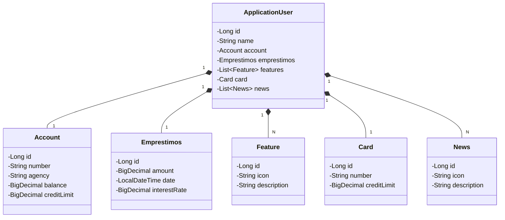

# Santander 2024 - Backend com Java

## Propósito Geral da Aplicação

Esta aplicação tem como objetivo fornecer uma API RESTful robusta e escalável para o backend de um sistema bancário fictício do Santander. Ela foi construída com Java 17 e Spring Boot 3, incorporando as melhores práticas e tecnologias modernas para garantir alta performance, segurança e facilidade de manutenção. Ela foi idealizada com base nas orientações recebidas da empresa DIO.io, do curso " Santander 2024 - Backend com Java, ", atividade de Desafio " Publicando Sua API REST na Nuvem Usando Spring Boot 3, Java 17 e Railway"

## Principais Tecnologias

- **Java 17**: Utilizamos a versão LTS mais recente do Java, aproveitando as inovações e melhorias de performance.
- **Spring Boot 3**: Framework que facilita a criação de aplicações stand-alone, de produção, com a premissa de autoconfiguração.
- **Spring Data JPA**: Simplifica a camada de acesso a dados, facilitando a integração com bancos de dados SQL.
- **OpenAPI (Swagger)**: Ferramenta para documentação de API, proporcionando uma interface interativa e intuitiva para desenvolvedores.
- **H2 Database**: Banco de dados em memória utilizado para desenvolvimento e testes.
- **Railway**: Plataforma para deploy e monitoramento na nuvem, oferecendo diversos bancos de dados como serviço e pipelines de CI/CD.

## Diagrama de Classes (Domínio da API)

## Arquitetura do Projeto

A aplicação segue a arquitetura de camadas, dividida da seguinte forma:

  1. Camada de Apresentação (Controller): Responsável por lidar com as requisições HTTP e enviar respostas adequadas. Exemplos de classes: ApplicationUserController.
  2. Camada de Serviço (Service): Contém a lógica de negócios e validações. Exemplos de classes: ApplicationUserService.
  3. Camada de Persistência (Repository): Lida com a comunicação com o banco de dados utilizando Spring Data JPA. Exemplos de classes: ApplicationUserRepository.
  4. Camada de Modelo (Model): Define as entidades do banco de dados. Exemplos de classes: ApplicationUser, Account, Card.

## Configuração da Base de Dados

Utilizamos o banco de dados em memória H2 para facilitar o desenvolvimento e os testes. As configurações podem ser encontradas no arquivo application.properties:

spring.application.name=Santander-2024-Backend-com-Java
server.port=8082
spring.datasource.url=jdbc:h2:mem:sdw2023
spring.datasource.driverClassName=org.h2.Driver
spring.datasource.username=sdw2023
spring.datasource.password=
spring.jpa.database-platform=org.hibernate.dialect.H2Dialect
spring.h2.console.enabled=true
spring.h2.console.path=/h2-console

## Acesso ao Console H2

Use os seguintes detalhes para se conectar ao banco de dados no console H2:

  1.JDBC URL: jdbc:h2:mem:sdw2023
  1.User Name: sdw2023
  3.Password: (deixe em branco)

Para acessar o console H2, abra o navegador e vá para [http://localhost:8082/h2-console](http://localhost:8082/h2-console).

## Documentação da API (Swagger)

A documentação da API é gerada automaticamente pelo Swagger e pode ser acessada em: [http://localhost:8082/swagger-ui.html](http://localhost:8082/swagger-ui.html)

## Como Utilizar a Aplicação

1.Clone o repositório:

  git clone [https://github.com/IOVASCON/Santander-2024-Backend-com-Java.git](https://github.com/IOVASCON/Santander-2024-Backend-com-Java.git)

2.Navegue até o diretório do projeto:

  cd Santander-2024-Backend-com-Java
  
3.Compile e inicie a aplicação:

./gradlew bootRun

4.Acesse a API via Postman ou seu navegador:
  API Endpoint: [http://localhost:8082/api/application_users](http://localhost:8082/api/application_users)

  Swagger UI: [http://localhost:8082/swagger-ui.html](http://localhost:8082/swagger-ui.html)

  Console H2: [http://localhost:8082/h2-console](http://localhost:8082/h2-console)

## Estrutura do Projeto

O projeto segue uma arquitetura em camadas, organizada da seguinte forma:

  1. Camada de Apresentação (Controller): Esta camada é responsável por lidar com as requisições HTTP e enviar respostas adequadas. Ela interage diretamente com a camada de serviço para processar as requisições.
        Controladores:
            NewsController.java
            HomeController.java

  2. Camada de Serviço (Service): Contém a lógica de negócios e validações. Esta camada é responsável por aplicar as regras de negócio e fazer a mediação entre a camada de apresentação e a camada de persistência.
        Serviços:
            AccountService.java
            ApplicationUserService.java
            CardService.java
            EmprestimosService.java
            FeatureService.java
            NewsService.java

  3. Camada de Persistência (Repository): Lida com a comunicação com o banco de dados utilizando Spring Data JPA. Esta camada abstrai o acesso aos dados, permitindo operações de CRUD de forma simples.
        Repositórios:
            AccountRepository.java
            ApplicationUserRepository.java
            CardRepository.java
            EmprestimosRepository.java
            FeatureRepository.java
            NewsRepository.java

  4. Camada de Modelo (Model): Define as entidades do banco de dados. Esta camada contém as classes que representam as tabelas do banco de dados, juntamente com as anotações JPA para mapear os campos.
        Modelos:
            Account.java
            ApplicationUser.java
            BaseItem.java
            Card.java
            Emprestimos.java
            Feature.java
            News.java

  5. Configuração e Inicialização:
        Configuração:
            application.properties
            application-dev.yml
        Inicialização:
            Application.java

  6. Recursos Estáticos e Templates: Contém recursos estáticos como arquivos HTML, CSS, JavaScript, e templates utilizados na aplicação.
        Recursos:
            static
            templates

  7. Testes: Contém os testes unitários e de integração da aplicação.
        Testes:
            test

## Estrutura Completa da Aplicação

SANTANDER-2024-BACKEND-COM-JAVA/
│
├── src/
│   └── main/
│       └── java/
│           └── me/
│               └── dio/
│                   └── dominio/
│                       ├── controller/
│                       │   ├── NewsController.java
│                       │   └── HomeController.java
│                       ├── model/
│                       │   ├── Account.java
│                       │   ├── ApplicationUser.java
│                       │   ├── BaseItem.java
│                       │   ├── Card.java
│                       │   ├── Emprestimos.java
│                       │   ├── Feature.java
│                       │   └── News.java
│                       ├── repository/
│                       │   ├── AccountRepository.java
│                       │   ├── ApplicationUserRepository.java
│                       │   ├── CardRepository.java
│                       │   ├── EmprestimosRepository.java
│                       │   ├── FeatureRepository.java
│                       │   └── NewsRepository.java
│                       └── service/
│                           ├── AccountService.java
│                           ├── ApplicationUserService.java
│                           ├── CardService.java
│                           ├── EmprestimosService.java
│                           ├── FeatureService.java
│                           └── NewsService.java
│       ├── resources/
│       │   ├── static/
│       │   ├── templates/
│       │   ├── application-dev.yml
│       │   └── application.properties
│       ├── Application.java
│       └── HomeController.java
├── .gitignore
├── build.gradle
├── gradle.properties
├── gradlew
├── gradlew.bat
├── HELP.md
├── README.md
└── settings.gradle

## Contribuição

Contribuições são bem-vindas! Sinta-se à vontade para abrir issues e pull requests.

## Licença

Este projeto está licenciado sob a Licença MIT - veja o arquivo LICENSE.md para mais detalhes.

Essa versão do `README.md` inclui uma visão geral do projeto, as tecnologias utilizadas, um diagrama de classes, instruções detalhadas para configurar e executar a aplicação, informações sobre a base de dados e a documentação da API. Além disso, oferece orientações para contribuições e informações sobre a licença.

## AUTOR

Izairton Oliveira de Vasconcelos
Iniciante na Linguagem Java
Créditos de adpatação do curso " Santander 2024 - Backend com Java " da DIO.io
